# Multi-Agent Azure Container Apps (ACA) System

This is a **Multi-Agent Azure Container Apps (ACA) System** that implements a microservices-based AI platform with specialized agents communicating via the A2A (Agent-to-Agent) protocol.

## Architecture Overview

The system consists of **4 main services**:

1. **🌐 Web Agent** (`web/`) - Performs web searches using OpenAI and returns current information
2. **📚 RAG Agent** (`rag/`) - Searches a knowledge base of project descriptions using Azure AI Foundry
3. **🔄 MCP Service** (`mcp/`) - Model Context Protocol server that orchestrates communication between conversation service and agents
4. **💬 Conversation Service** (`conversation/`) - Chainlit-based chat interface for user interaction

## How It Works

```mermaid
graph TD
    User[👤 User] --> Conversation[💬 Conversation Service<br/>Chainlit UI]
    Conversation --> MCP[🔄 MCP Service<br/>FastMCP Server]
    MCP --> Web[🌐 Web Agent<br/>OpenAI + Web Search]
    MCP --> RAG[📚 RAG Agent<br/>Azure AI Foundry]
    
    Web --> WebAPI[Web Search APIs]
    RAG --> AzureAI[Azure AI Foundry<br/>Knowledge Base]
    
    style User fill:#e1f5fe
    style Conversation fill:#f3e5f5
    style MCP fill:#e8f5e8
    style Web fill:#fff3e0
    style RAG fill:#fce4ec
```



### System Flow

- Users interact through a **Chainlit chat interface**
- The **MCP service** implements tools; tools call the web and rag agents
- **Web Agent** provides current web information using OpenAI and web search APIs
- **RAG Agent** searches internal project documentation (sample projects: Astro Events, EduForge, MediTrack, Green Grocer, PetPal); see `project_descriptions`folder for sample data.
- MCP tools communicate using the **A2A protocol** for seamless agent-to-agent interaction

### Infrastructure

**Azure Resources Deployed:**
- Azure AI Foundry (with private networking)
- Azure Container Apps Environment
- Azure Container Registry  
- Virtual Network with private endpoints
- Private DNS zones for secure communication
- User-assigned managed identity for secure access

## Installation Steps

### Prerequisites

1. **Azure CLI** installed and authenticated:
```bash
az login
az account set --subscription "your-subscription-id"
```

2. **Environment Variables** - Create `.env` file in project root:
```bash
# Azure AI Foundry
FOUNDRY_PROJECT="https://your-foundry-project.cognitiveservices.azure.com/"
ASSISTANT_ID="your-assistant-id"
CLIENT_ID="your-managed-identity-client-id"

# OpenAI
OPENAI_API_KEY="your-openai-api-key"

# Optional Redis
USE_REDIS="False"
```

### Step 1: Deploy Infrastructure

Navigate to the bicep directory and deploy the infrastructure:

```bash
cd bicep
./deploy.sh
```

This deploys:
- AI Foundry with private networking and network access controls
- Container Apps environment with VNet integration
- Container registry with managed identity
- All networking components (VNet, subnets, private endpoints, DNS zones)
- Role assignments for secure access

### Step 2: Deploy Containers

Use the deployment script to build and deploy containers:

```bash
# Deploy all services
./deploy_containers.sh --to-build rag,web,mcp,conversation

# Or deploy specific services
./deploy_containers.sh --to-build web,rag
./deploy_containers.sh --to-build mcp --skip-build
```

The script:
1. Builds container images using ACR tasks
2. Deploys them to Azure Container Apps
3. Configures internal networking between services
4. Exposes the conversation service externally
5. Sets up environment variables and secrets

### Step 3: Access the Application

After deployment, the conversation service will be available at:
```
https://ca-conversation.{your-container-app-domain}/
```

You can find the exact URL in the deployment output.

## Local Development

To run locally for development:

```bash
# Terminal 1 - RAG Service
cd rag && python main.py

# Terminal 2 - Web Service  
cd web && python main.py

# Terminal 3 - MCP Service
cd mcp && python main.py

# Terminal 4 - Conversation UI
cd conversation && chainlit run main.py
```

### Local Environment Setup

1. Install Python dependencies for each service:
```bash
cd web && pip install -r requirements.txt
cd ../rag && pip install -r requirements.txt
cd ../mcp && pip install -r requirements.txt
cd ../conversation && pip install -r requirements.txt
```

2. Set up your `.env` file with the required credentials
3. Ensure all services can communicate (adjust URLs in local mode)

## Key Dependencies

- **A2A SDK**: Agent-to-agent communication protocol
- **FastMCP**: Model Context Protocol implementation
- **Chainlit**: Chat interface framework
- **Semantic Kernel**: AI orchestration framework
- **Azure AI Projects**: RAG with Azure AI Foundry
- **OpenAI**: Language model for web agent
- **httpx**: Async HTTP client for service communication

## Service Details

### Web Agent (`web/`)
- Uses OpenAI GPT models with hosted web search tool
- Implements A2A protocol for seamless integration
- Provides current information from web sources
- Configurable with internal networking

### RAG Agent (`rag/`)
- Connects to Azure AI Foundry for knowledge base search via built-in files tool (documents uploaded to files tool)
- Searches project descriptions and documentation
- Uses managed identity for secure Azure access
- Returns relevant project information

### MCP Service (`mcp/`)
- Central orchestration hub using FastMCP
- Manages communication between agents and conversation service
- Provides unified tool interface
- Handles routing and response aggregation

### Conversation Service (`conversation/`)
- Chainlit-based chat interface
- Integrates with Semantic Kernel
- Provides user-friendly interaction
- Routes queries to appropriate agents via MCP
